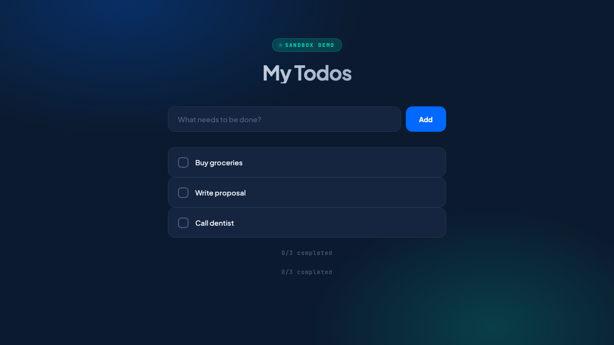
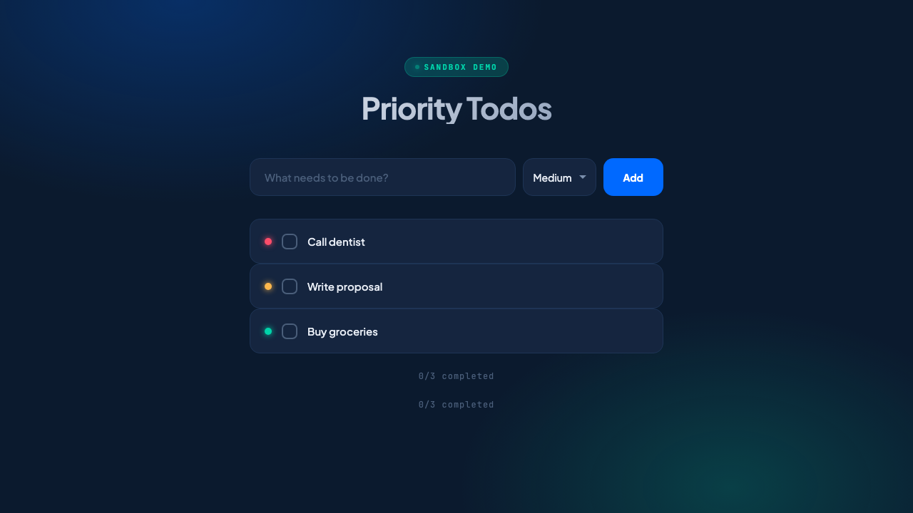
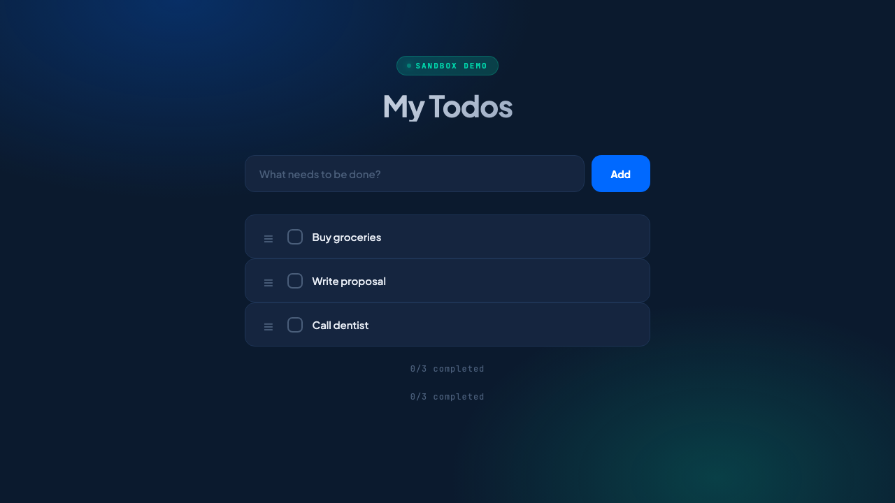
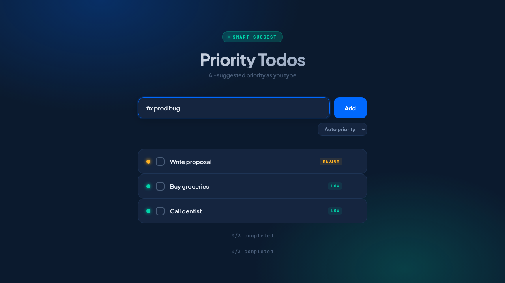

# Deploy Conference Demo

Flask + HTMX todo app with 3 feature variants, showcasing the `do-app-sandbox` SDK's **snapshot, fork, preview** workflow.

An AI agent deploys a base todo app, snapshots it, then forks 3 different implementations as live previews — all on DigitalOcean App Platform.

## Try It Yourself

### Local (no cloud needed)

```bash
cd demo
python3 -m venv .venv && source .venv/bin/activate
pip install flask
python app.py  # http://localhost:8080
```

Try each variant:
```bash
python variants/priority_color_badges.py   # Priority with colored dots
python variants/priority_drag_reorder.py   # Drag-to-reorder todos
python variants/priority_smart_suggest.py  # AI-suggested priority from text
```

### Deploy to App Platform

**With an AI coding assistant** (Claude Code, Cursor, etc.):

> Deploy the demo todo app to DigitalOcean App Platform using the do-app-sandbox SDK. Create a sandbox, upload app.py, install Flask, start the app. Then snapshot it to DO Spaces, fork 3 new sandboxes from the snapshot, upload each variant, and start them. Show me all 3 live preview URLs.

The assistant will need:
- `doctl` installed and authenticated (`doctl auth init`)
- `pip install do-app-sandbox boto3`
- A DO Spaces bucket with credentials:

```bash
export SPACES_ACCESS_KEY="..."
export SPACES_SECRET_KEY="..."
export SPACES_BUCKET="your-bucket"
export SPACES_REGION="nyc3"
```

**Or run the scripts directly:**

```bash
# Full deployment: base app → snapshot → fork 3 variants
python deploy_live.py

# Interactive demo with teardown
python demo_runner.py

# Benchmark cold start vs warm pool
python benchmark_warmpool.py
```

## What's Inside

| File | Description |
|------|-------------|
| `app.py` | Base todo app — dark DO-branded UI, HTMX interactions |
| `variants/priority_color_badges.py` | Adds colored priority dots (red/yellow/green) |
| `variants/priority_drag_reorder.py` | Adds drag-to-reorder with SortableJS |
| `variants/priority_smart_suggest.py` | Suggests priority from text keywords in real-time |
| `demo_runner.py` | Interactive demo: create → snapshot → fork → pick winner |
| `deploy_live.py` | Non-interactive full deployment |
| `benchmark_warmpool.py` | Measures cold start vs warm pool timing |

## The Demo Flow

```
1. Deploy base todo app to sandbox          (~35s cold start)
2. Snapshot app + deps to DO Spaces         (~3s)
3. Fork 3 sandboxes from snapshot           (~8s with warm pool)
4. Upload variant to each, start Flask
5. All 3 get public HTTPS URLs
6. PM picks the winner, tear down the rest
```

## Cold Start vs Warm Pool

| Phase | Cold Start | Warm Pool |
|-------|-----------|-----------|
| Container ready | 34.6s | **0.7s** |
| Snapshot restore | 2.9s | 2.7s |
| App startup | 4.6s | 4.6s |
| **Total** | **42.1s** | **~8s** |

The warm pool uses `SandboxManager` with `PoolConfig(target_ready=3)` to maintain pre-created containers. Acquiring from the pool is 50x faster than cold start.

## Screenshots

| Base App | Color Badges | Drag Reorder | Smart Suggest |
|----------|-------------|-------------|--------------|
|  |  |  |  |
